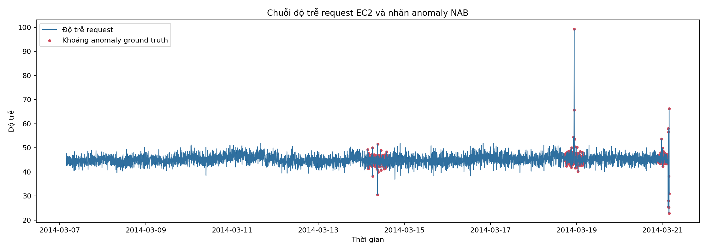
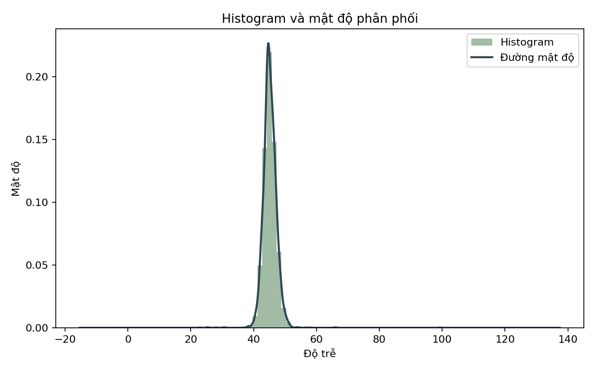
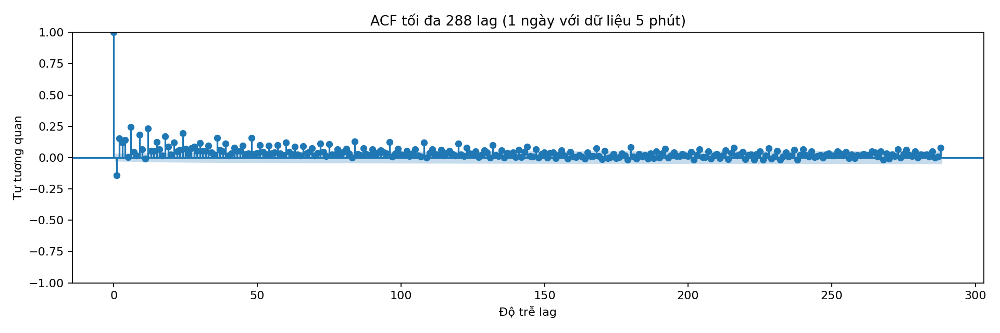
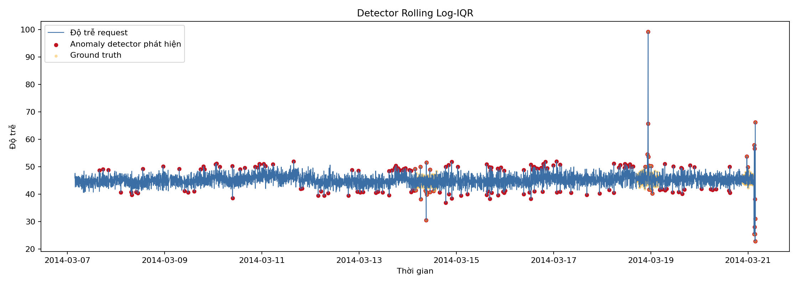
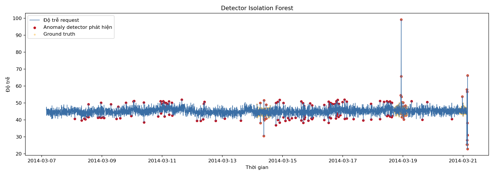
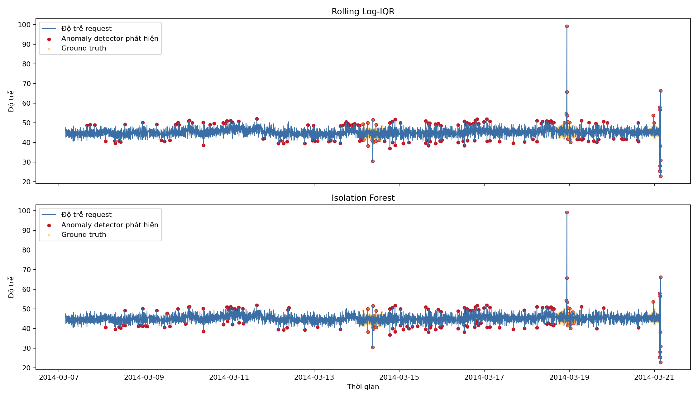
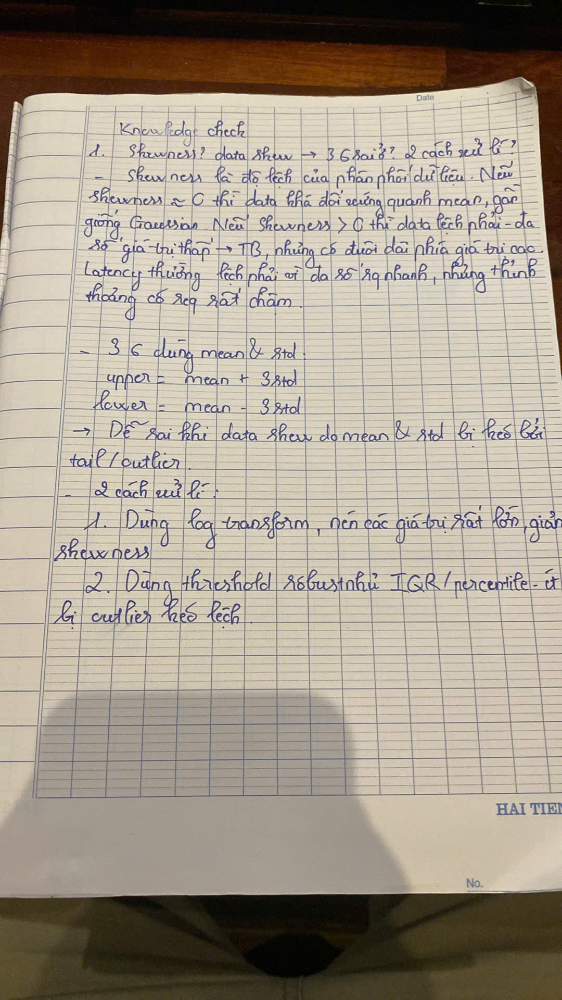
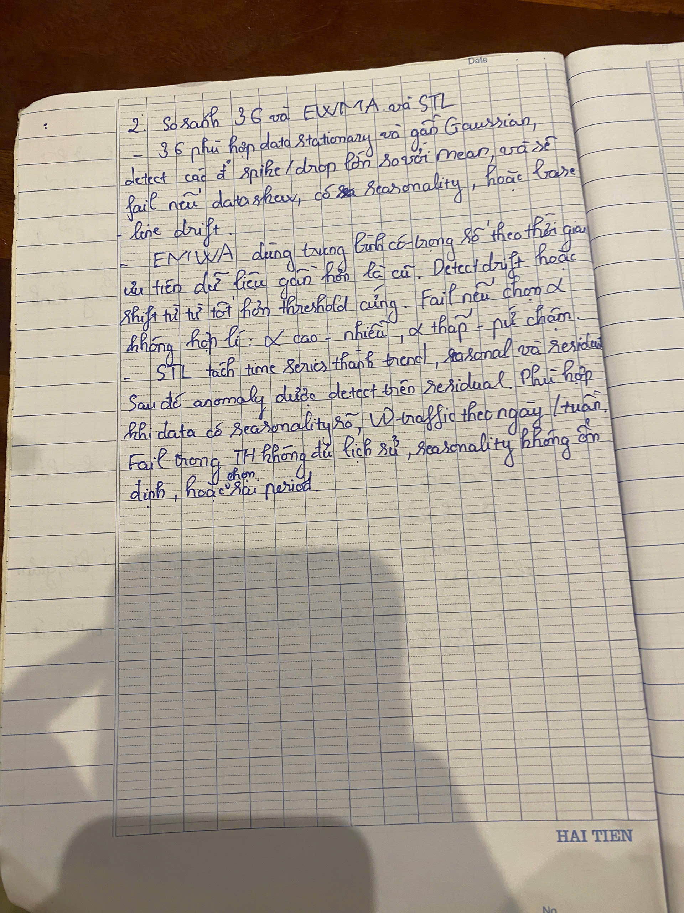
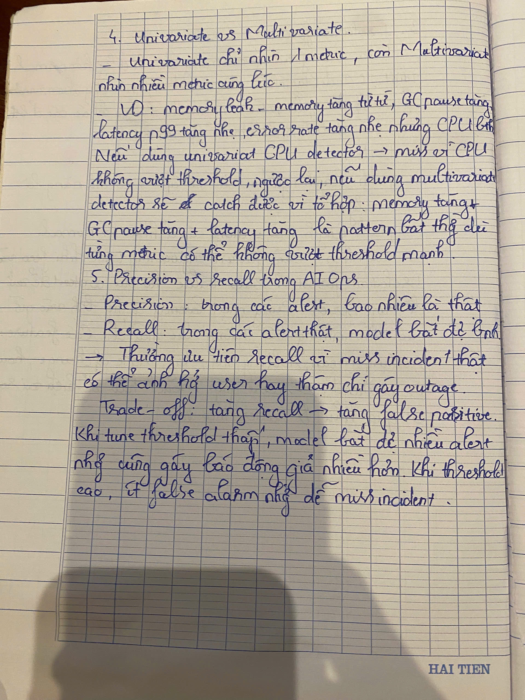

# W1-D1: Metric Anomaly Detection

## Dataset

- File NAB: `realKnownCause/ec2_request_latency_system_failure.csv`
- Số dòng: 4032
- Khoảng thời gian: 2014-03-07 03:41:00 đến 2014-03-21 03:41:00
- Chu kỳ lấy mẫu: 5 phút
- Điểm anomaly theo ground truth: 346 điểm, chiếm 8.58%

## EDA

- Mean: 45.156
- Std: 2.287
- Min / Max: 22.864 / 99.248
- Skewness: 3.062

Kết luận: Series latency bị lệch phải rõ rệt và có các khoảng anomaly đã được gán nhãn bởi NAB. Vì latency thường có đuôi dài ở phía giá trị cao, dùng raw 3-sigma sẽ rủi ro. Baseline thống kê phù hợp hơn là Rolling Log-IQR; Isolation Forest dùng thêm các feature theo ngữ cảnh để bắt những thay đổi hình dạng mà threshold đơn giản dễ bỏ sót.

### Figure 1 - Raw time series và ground truth anomaly

Biểu đồ này cho thấy chuỗi latency theo thời gian. Các điểm ground truth anomaly được lấy từ NAB `combined_windows.json`.

### Figure 2 - Histogram và density

Biểu đồ phân phối cho thấy latency bị lệch phải: phần lớn giá trị nằm ở vùng thấp/trung bình, nhưng có tail kéo dài về phía giá trị cao.

### Figure 3 - ACF

ACF dùng để kiểm tra tự tương quan và dấu hiệu seasonality. Kết quả này giúp chọn detector phù hợp thay vì dùng threshold cố định một cách mù quáng.

## Kết Quả Detector

| Detector | Precision | Recall | F1 | False alarms | TP | FP | FN | TN |
|:--|--:|--:|--:|--:|--:|--:|--:|--:|
| Rolling Log-IQR | 0.175532 | 0.095376 | 0.123596 | 155 | 33 | 155 | 313 | 3531 |
| Isolation Forest | 0.365000 | 0.210983 | 0.267399 | 127 | 73 | 127 | 273 | 3559 |

## Log Tune Detector Thống Kê

| Window | k | Precision | Recall | F1 | False alarms | TP | FP | FN | TN |
|--:|--:|--:|--:|--:|--:|--:|--:|--:|--:|
| 144 | 1.50 | 0.200000 | 0.057803 | 0.089686 | 80 | 20 | 80 | 326 | 3606 |
| 288 | 1.25 | 0.175532 | 0.095376 | 0.123596 | 155 | 33 | 155 | 313 | 3531 |
| 288 | 0.50 | 0.097239 | 0.234104 | 0.137405 | 752 | 81 | 752 | 265 | 2934 |

Em chọn `window=288`, `k=1.25` cho Rolling Log-IQR. Cấu hình `k=0.5` có F1 cao hơn một chút nhưng tạo 752 false alarms, quá nhiều cho on-call trong production.

### Figure 4 - Rolling Log-IQR detector

Biểu đồ này highlight các điểm anomaly do detector thống kê Rolling Log-IQR phát hiện, so với ground truth.

### Figure 5 - Isolation Forest detector

Biểu đồ này highlight các điểm anomaly do Isolation Forest phát hiện. IF dùng feature context như rolling mean, rolling std, lag, rate of change, hour và z-score.

### Figure 6 - So sánh hai detector

Biểu đồ 2 subplot đặt Rolling Log-IQR và Isolation Forest cạnh nhau để dễ so sánh vị trí anomaly được phát hiện.

## Log Tune Isolation Forest

| Contamination | Precision | Recall | F1 | False alarms | TP | FP | FN | TN |
|--:|--:|--:|--:|--:|--:|--:|--:|--:|
| 0.01 | 0.825000 | 0.095376 | 0.170984 | 7 | 33 | 7 | 313 | 3632 |
| 0.02 | 0.612500 | 0.141618 | 0.230047 | 31 | 49 | 31 | 297 | 3608 |
| 0.05 | 0.365000 | 0.210983 | 0.267399 | 127 | 73 | 127 | 273 | 3512 |

Best contamination dùng cho so sánh cuối: `0.05`.

Model artifact:

- `models/isolation_forest_ec2_latency.joblib`

## Reflection

Dataset này giống một metric latency thực tế: phân phối không Gaussian, bị lệch phải mạnh với skewness=3.062, nên raw 3-sigma không phải lựa chọn tốt nhất. Rolling Log-IQR dễ giải thích, chi phí thấp và robust với skew, nhưng chỉ nhìn một metric nên còn miss nhiều contextual anomaly. Isolation Forest dùng các feature theo ngữ cảnh như rolling mean, rolling std, lag, rate of change, hour và z-score. Isolation Forest có F1 tốt hơn trong lần chạy này.

Nếu đưa vào production AIOps, em sẽ ưu tiên recall cho metric quan trọng như latency/error rate, sau đó kiểm soát alert fatigue bằng correlation, service ownership và severity routing.

## Knowledge Check

### Question 1 - Skewness, data skewed và 3-sigma

Ảnh này trả lời skewness là gì, vì sao data bị skew làm 3-sigma sai, và hai cách xử lý là log transform và IQR/percentile.

### Question 2 - So sánh 3-sigma, EWMA, STL

Ảnh này so sánh mỗi phương pháp detect loại anomaly nào, fail ở đâu, và nên dùng trong trường hợp nào.

### Question 3 - Isolation Forest

Ảnh này giải thích ý tưởng `path length ngắn = anomaly` và vì sao cần feature engineering trước khi feed time series vào Isolation Forest.

### Question 4-5 - Univariate vs Multivariate, Precision vs Recall

Ảnh này trả lời scenario memory leak cho univariate/multivariate và giải thích vì sao AIOps thường ưu tiên recall, cùng trade-off khi tune threshold.

