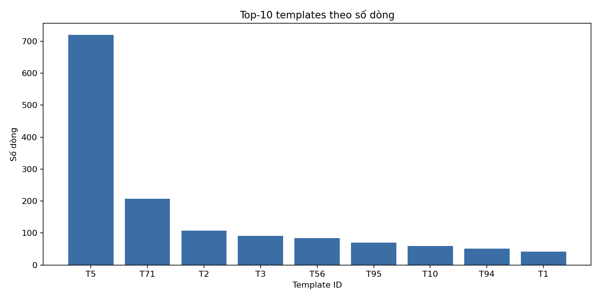
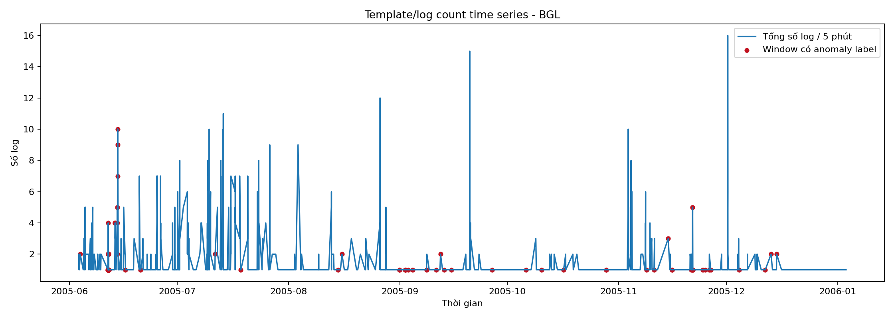
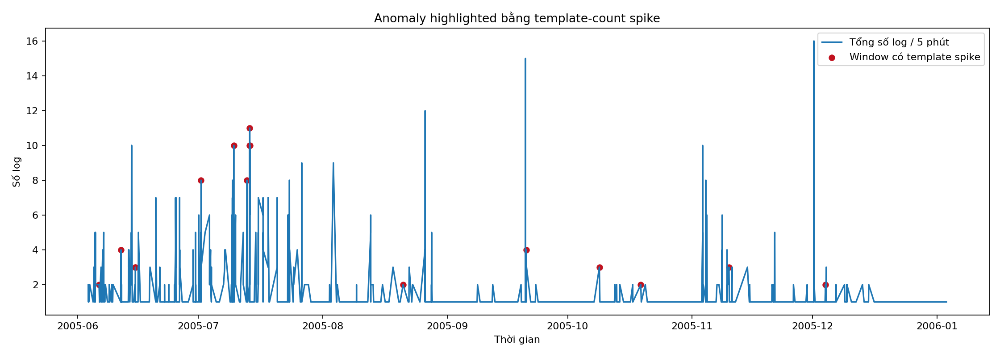
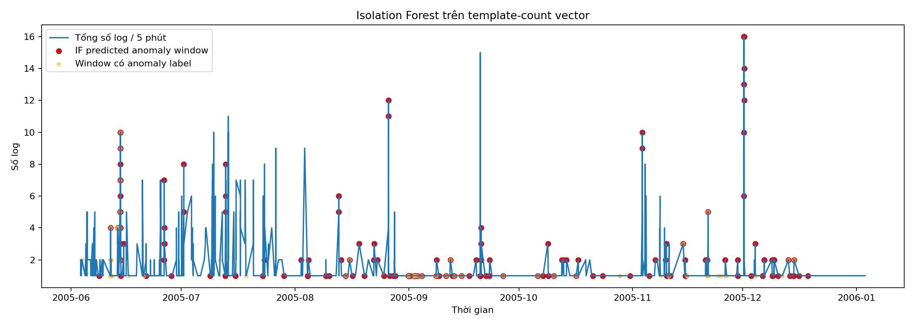
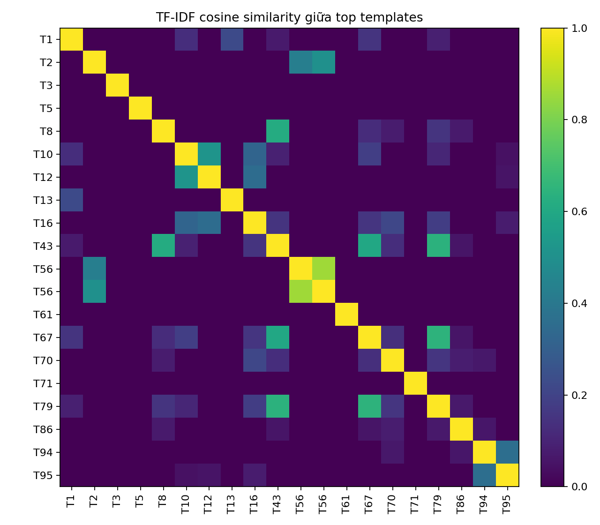
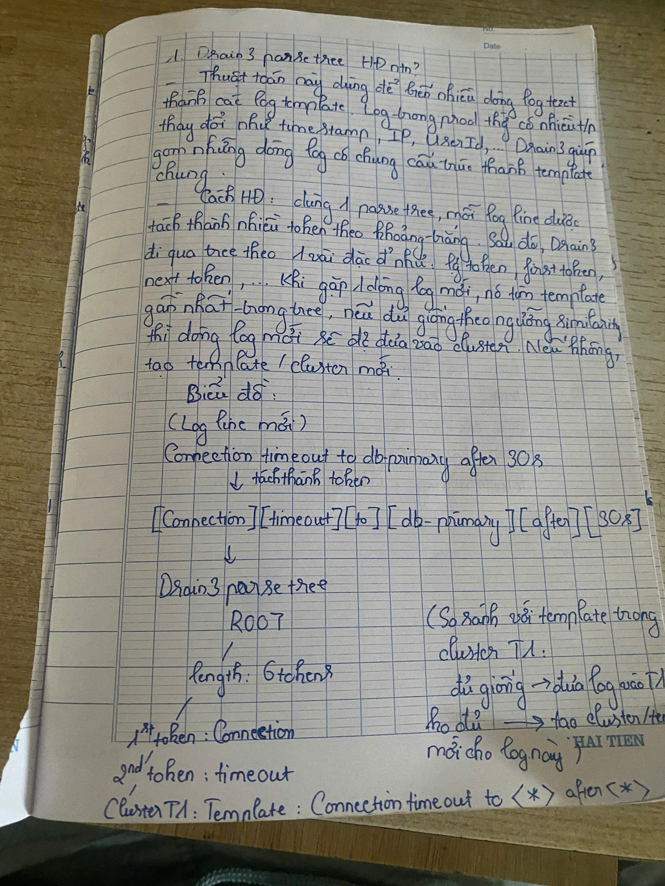
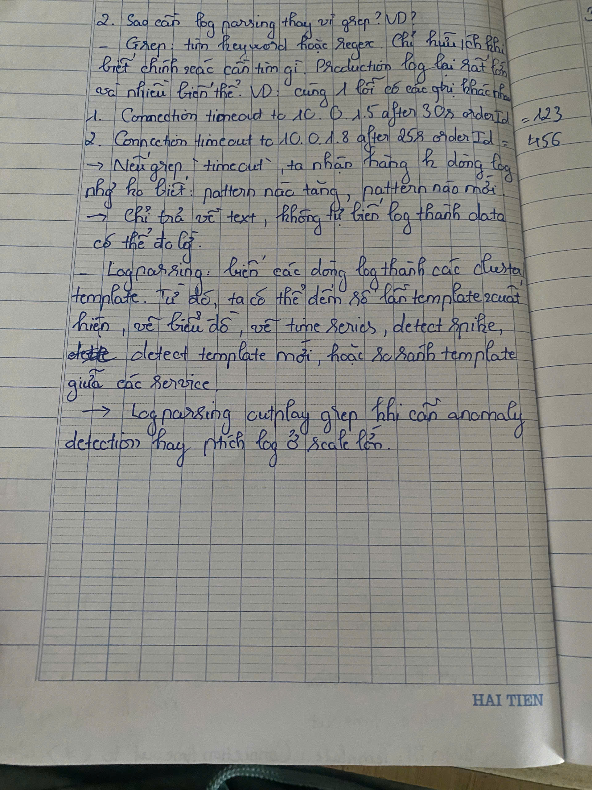
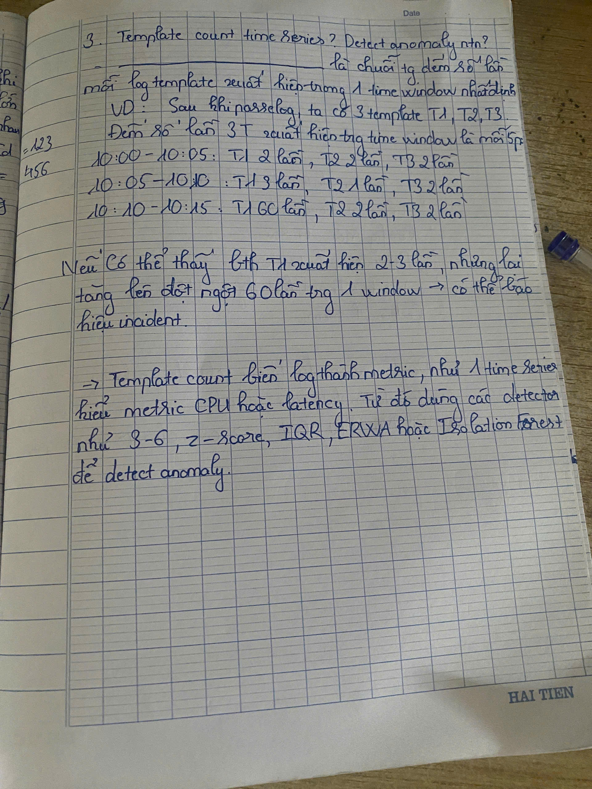
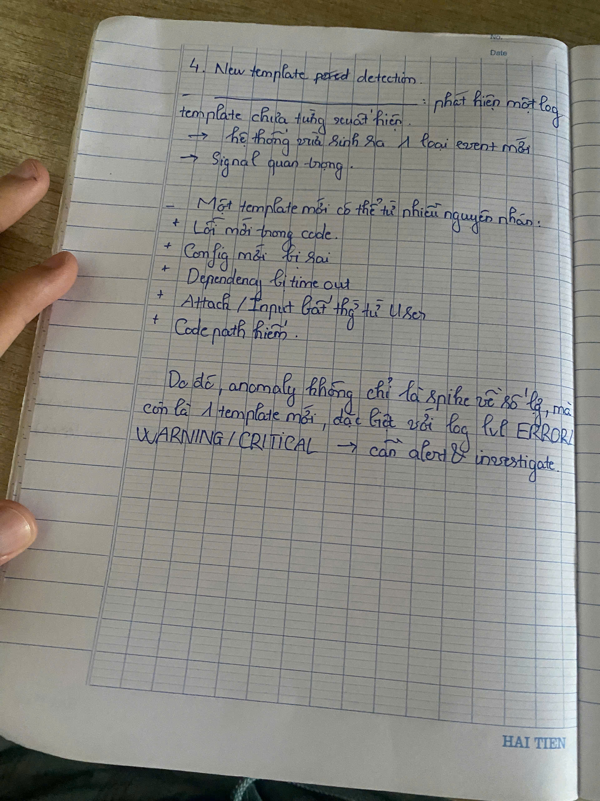
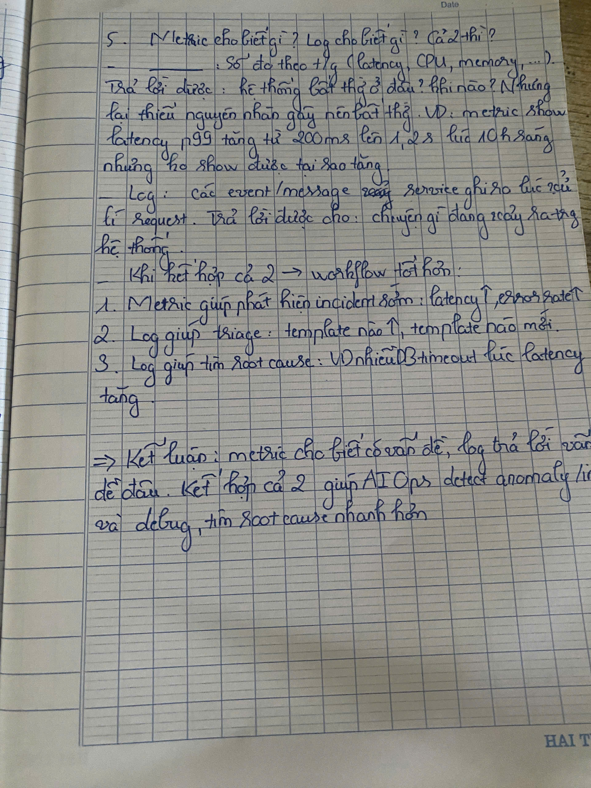

# W1-D2: Log Mining + Parsing + Anomaly từ Log

## Dataset

- Dataset chính: Loghub `BGL_2k.log`
- Dataset phụ để test script: Loghub `HDFS_2k.log`
- Lý do chọn BGL làm dataset chính: BGL có label anomaly ngay trong mỗi dòng log. Label `-` là normal, label khác `-` là anomaly.
- Tổng số dòng BGL: 2000
- Số dòng anomaly theo label: 143

## Phase 1: Drain3 Parsing

Em parse phần log content bằng Drain3, sau đó gom các dòng giống nhau thành templates.

### Drain3 tuning log

| drain_sim_th | Unique templates | Nhận xét |
|---:|---:|---|
| 0.3 | 100 | Merge mạnh hơn, dễ gom các pattern khác nhau vào cùng template |
| 0.5 | 108 | Cân bằng nhất, được chọn cho bài |
| 0.7 | 919 | Tách quá vụn, gần như mỗi biến thể thành template riêng |

Kết quả chính với `sim_th=0.5`:

- Total lines: 2000
- Unique templates: 108
- Anomaly lines: 143

Top-10 templates được export tại:

```text
results/top_templates.csv
```

### Figure 1 - Top-10 templates

Biểu đồ này cho thấy các template xuất hiện nhiều nhất sau khi Drain3 parse BGL log.



## Phase 2: Anomaly Detection trên Log

Em tạo template/log count time series theo window 5 phút. Ý tưởng là nếu một template tăng đột biến trong một window, đó có thể là signal anomaly.

### Figure 2 - Template/log count time series

Biểu đồ này vẽ tổng số log theo window 5 phút và đánh dấu những window có anomaly label từ BGL.



### Detector 1: Template-count spike bằng z-score

Detector này tính count của từng template theo window, sau đó dùng z-score để tìm template spike bất thường.

| Metric | Value |
|---|---:|
| Precision | 0.048 |
| Recall | 0.028 |
| F1 | 0.035 |
| False alarms | 79 |
| TP | 4 |
| FP | 79 |
| FN | 139 |
| TN | 1778 |

### Figure 3 - Template-count spike anomaly highlighted

Biểu đồ này highlight các window có template-count spike theo z-score.



### Detector 2: Isolation Forest trên template-count vector

Mỗi window 5 phút được biến thành một vector, mỗi feature là count của một template. Isolation Forest detect các window có pattern template-count khác thường.

| Contamination | Precision | Recall | F1 | False alarms | TP | FP | FN | TN |
|---:|---:|---:|---:|---:|---:|---:|---:|---:|
| 0.01 | 0.222 | 0.021 | 0.038 | 7 | 2 | 7 | 93 | 729 |
| 0.03 | 0.167 | 0.042 | 0.067 | 20 | 4 | 20 | 91 | 716 |
| 0.05 | 0.122 | 0.053 | 0.074 | 36 | 5 | 36 | 90 | 700 |
| 0.10 | 0.084 | 0.074 | 0.079 | 76 | 7 | 76 | 88 | 660 |
| 0.20 | 0.171 | 0.295 | 0.216 | 136 | 28 | 136 | 67 | 600 |

Best setting theo F1: `contamination=0.20`.

### Figure 4 - Isolation Forest anomaly windows

Biểu đồ này so sánh window được Isolation Forest dự đoán anomaly với window có anomaly label.



## Phase 3: Embedding + New Template Detection

Em dùng TF-IDF trên template text để tính cosine similarity giữa các templates. Những template có similarity cao có thể thuộc cùng một nhóm sự kiện.

### Figure 5 - TF-IDF similarity heatmap

Heatmap này thể hiện cosine similarity giữa top templates.



### Injected New Template

Em inject một dòng log lạ:

```text
CRITICAL payment-service quantum cache exploded for tenant=abc retry_budget=-999 unusual_token=ZXCV_NOT_SEEN_BEFORE
```

Drain3 tạo template mới:

```json
{
  "change_type": "cluster_created",
  "cluster_id": 109,
  "template": "CRITICAL payment-service quantum cache exploded for tenant=abc retry_budget=-999 unusual_token=ZXCV_NOT_SEEN_BEFORE"
}
```

Ý nghĩa: template mới là signal quan trọng vì nó có thể đại diện cho một loại lỗi/chế độ hệ thống chưa từng xuất hiện trước đó.

## Phase 4: Mini Log Analyzer

Script:

```text
log_analyzer.py
```

Chạy được:

```bash
python log_analyzer.py <logfile>
```

Script in ra:

- Tổng số dòng
- Số template unique
- Top-5 template, gồm count và % tổng
- Template spike trong check 1 giờ
- New templates trong giờ cuối

Kết quả test:

| Dataset | Total lines | Unique templates | Nhận xét |
|---|---:|---:|---|
| BGL_2k.log | 2000 | 108 | Log supercomputer phức tạp, nhiều loại kernel/app events |
| HDFS_2k.log | 2000 | 17 | Format đều hơn, ít template hơn |

Output script được lưu tại:

```text
results/log_analyzer_bgl.txt
results/log_analyzer_hdfs.txt
```

## Reflection

Drain3 parse BGL ở mức chấp nhận được. Với `sim_th=0.5`, parser tạo 108 templates từ 2000 dòng log. `sim_th=0.3` merge mạnh hơn nên chỉ có 100 templates; `sim_th=0.7` tách quá vụn, tạo 919 templates. Vì vậy em chọn `0.5`.

Template có insight nhất là các template xuất hiện nhiều như `generating <*>`, `iar <*> dear <*>`, và các template liên quan alignment/cache/parity. Chúng cho thấy sau khi parse, log text có thể trở thành signal định lượng để đếm và theo dõi theo thời gian.

Template-count spike detector có precision/recall thấp trên BGL 2k vì không phải anomaly nào cũng biểu hiện bằng volume spike. Isolation Forest trên template-count vector có F1 tốt hơn, nhưng vẫn có false alarm cao. Điều này phản ánh thực tế: log anomaly detection nên kết hợp nhiều signal hơn như template mới, severity, service/component và metric anomaly.

Metric cho biết hệ thống đang bất thường ở đâu, ví dụ latency tăng hoặc error rate tăng. Log giúp giải thích vì sao, ví dụ timeout DB, circuit breaker open, hoặc kernel error. Kết hợp metric + log giúp vừa detect incident vừa triage/root-cause nhanh hơn.

## Bonus

Em có kiểm tra Docker logs của project LLM4Reqs và export log từ 5 container: frontend, backend, llm, queue, reverb. Các log này được parse bằng cùng `log_analyzer.py`; parser cũng được bổ sung nhánh đọc timestamp ISO của Docker logs để có thể dùng các kiểm tra theo time window.

```bash
python log_analyzer.py data/docker_llm4reqs_frontend.log
python log_analyzer.py data/docker_llm4reqs_backend.log
python log_analyzer.py data/docker_llm4reqs_llm.log
```

| Container log | Số dòng | Số template | Nhận xét |
| --- | ---: | ---: | --- |
| `docker_llm4reqs_frontend.log` | 882 | 20 | Phần lớn là access log từ nginx, template lớn nhất chiếm khoảng 91.95%; cuối log có các template shutdown mới. |
| `docker_llm4reqs_backend.log` | 478 | 5 | Chủ yếu là request tới `/index.php`, template lớn nhất chiếm khoảng 97.70%; không thấy spike mạnh. |
| `docker_llm4reqs_llm.log` | 318 | 25 | Có log startup server, initialize Gemini, health check `GET /`, loading weights và shutdown. |
| `docker_llm4reqs_queue.log` | 4 | 2 | Log rất ngắn, chỉ thấy job `StreamMessageJob` chạy và hoàn tất. |
| `docker_llm4reqs_reverb.log` | 3 | 2 | Log rất ngắn, chỉ đủ thấy server start ở `0.0.0.0:8081`. |

Kết quả chi tiết được lưu tại:

```text
results/log_analyzer_llm4reqs_frontend.txt
results/log_analyzer_llm4reqs_backend.txt
results/log_analyzer_llm4reqs_llm.txt
results/log_analyzer_llm4reqs_queue.txt
results/log_analyzer_llm4reqs_reverb.txt
results/docker_llm4reqs_summary.csv
```

Nhận xét bonus: log thật có pattern lặp rất rõ, ví dụ access log và health check chiếm tỷ lệ lớn. Drain3 hữu ích ở đây vì nó gom các dòng khác IP, path, port, status hoặc timestamp thành template chung. Tuy nhiên log thật cũng cho thấy cần feature engineering trước khi detect anomaly: nên tách service, HTTP method/status/path, loại bỏ health check nếu quá áp đảo, rồi mới dùng template-count hoặc Isolation Forest để tránh false alarm.


## Knowledge Check

Các ảnh dưới đây là phần viết tay nộp kèm. Tên ảnh tương ứng với số câu trong yêu cầu assignment.

### Question 1 - Drain3 parse tree

Ảnh này giải thích Drain3 parse tree hoạt động thế nào và có sơ đồ đơn giản về cách log line được tách thành tokens, đi qua tree, rồi được gom vào template cluster.



### Question 2 - Vì sao cần log parsing thay vì grep

Ảnh này giải thích vì sao grep không đủ khi production log có nhiều biến thể như IP, timestamp, orderId, userId, và vì sao parsing giúp gom thành template để phân tích được.



### Question 3 - Template count time series

Ảnh này giải thích template count time series là gì: đếm số lần mỗi template xuất hiện theo từng time window, rồi dùng count đó như metric để detect spike/anomaly.



### Question 4 - New template detection

Ảnh này giải thích vì sao template mới là signal quan trọng: nó có thể đại diện cho lỗi mới, code path mới, config mới, hoặc behavior chưa từng xuất hiện trước đó.



### Question 5 - Metric vs Log

Ảnh này giải thích metric cho biết hệ thống bất thường ở đâu/khi nào, log giúp giải thích vì sao, và kết hợp cả hai giúp detect + triage + root-cause tốt hơn.


