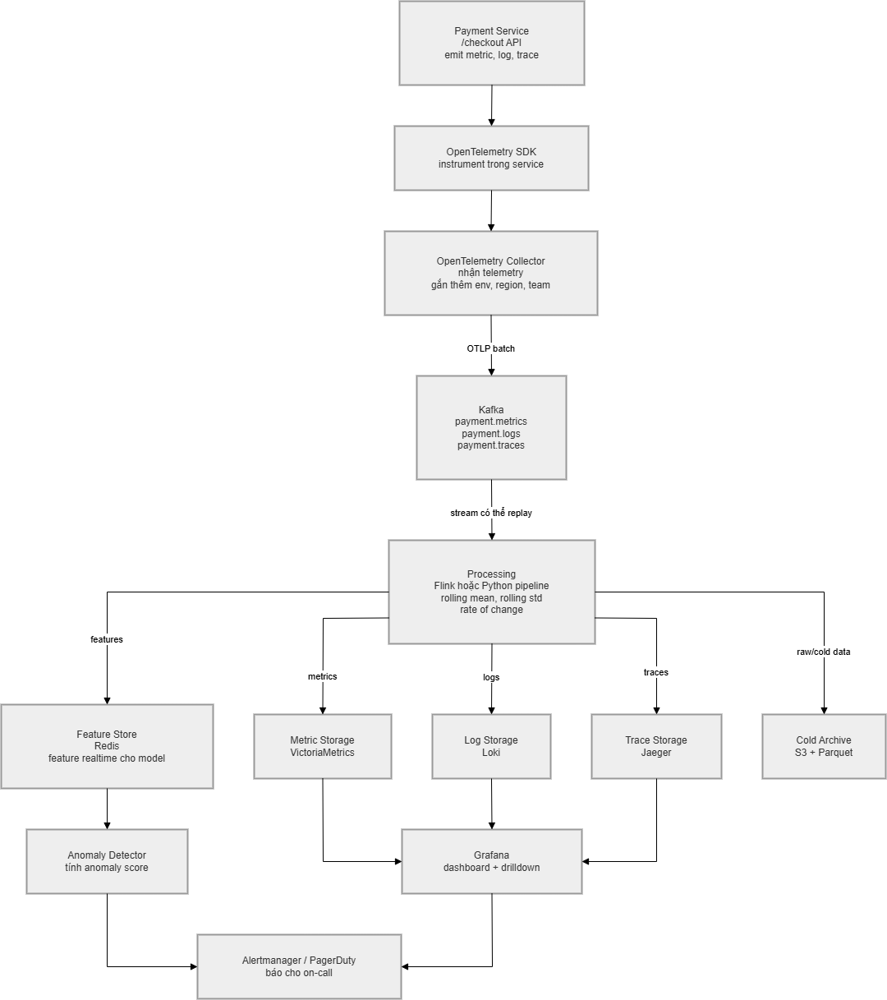

# W1-D3: Data Layer Architecture + Observability Pipeline

## Use Case

Em chọn use case **anomaly detection trên payment service**. Em hiểu bài toán là: payment service có endpoint `/checkout`, nếu latency hoặc error rate tăng bất thường thì hệ thống cần phát hiện sớm, sau đó người vận hành dùng trace và log để xem lỗi nằm ở đâu.

Riêng phần `pipeline.py`, assignment mới yêu cầu dùng dataset NAB `machine_temperature_system_failure.csv`, nên em dùng dataset này để mô phỏng một metric stream thật. Phần architecture vẫn lấy use case payment service như lựa chọn ban đầu.

## Phase 1: Architecture Design

Diagram chính nằm trong:

```text
architecture.md
diagram.md
```

Hình render của diagram chính:



### Giải thích ngắn

Service gửi metric, log, trace qua OpenTelemetry. Collector gom data lại rồi đẩy vào Kafka. Kafka đóng vai trò buffer để nếu processing hoặc storage bị chậm thì data chưa mất ngay. Sau đó processing layer tính feature như rolling mean, rolling std, rate of change. Feature được đưa vào model anomaly detection, còn raw telemetry thì lưu vào VictoriaMetrics, Loki, Jaeger hoặc S3.

## Pipeline

`pipeline.py` làm mock streaming pipeline:

1. Producer đọc file `data/realKnownCause/machine_temperature_system_failure.csv`.
2. Producer emit từng row vào Python `queue.Queue`.
3. Producer cũng ghi mỗi event ra `outputs/events.jsonl`.
4. Consumer đọc queue và tính feature trên stream.

Feature em tính:

- `rolling_mean_1h`
- `rolling_std_1h`
- `rate_of_change`
- `percent_change`
- `z_score_1h`

Output:

```text
outputs/events.jsonl
outputs/features.json
```

Kết quả sau khi chạy:

```text
CSV rows: 22695
Event rows: 22695
Feature rows: 22695
```

Lệnh assignment yêu cầu:

```bash
uv run python pipeline.py
```

Máy em hiện chưa có `uv`, nên em test bằng:

```bash
python pipeline.py
```

Script không dùng thư viện ngoài, nên nếu môi trường có `uv` thì `uv run python pipeline.py` cũng chạy được.

## Phase 2: Cost Estimation

`cost_model.py` estimate monthly cost cho 3 tier. Em chia self-host cost thành storage, compute, network, rồi so sánh với Datadog.

Output:

```text
outputs/cost_estimate.csv
outputs/cost_estimate.json
outputs/cost_estimate.md
```

| tier | services | log_gb_day | metric_events_sec | build_storage_usd | build_compute_usd | build_network_usd | build_total_usd | datadog_total_usd | build_vs_buy_delta_usd | recommendation |
| --- | ---: | ---: | ---: | ---: | ---: | ---: | ---: | ---: | ---: | --- |
| Small | 10 | 50 | 100000 | 640.4 | 200.0 | 30.0 | 870.4 | 2100.0 | 1229.6 | Buy first |
| Medium | 100 | 500 | 1000000 | 6404.0 | 2000.0 | 300.0 | 8704.0 | 21000.0 | 12296.0 | Hybrid / build core pipeline |
| Large | 1000 | 5000 | 10000000 | 64040.0 | 20000.0 | 3000.0 | 87040.0 | 210000.0 | 122960.0 | Hybrid / build core pipeline |

Em hiểu bảng này chỉ là estimate đơn giản. Nó chưa tính lương engineer, thời gian vận hành, incident cost, hay discount từ vendor.

## Phase 3: ADR Summary

ADR nằm ở:

```text
ADR-001.md
```

Quyết định của em: **dùng Kafka thay vì direct push từ Collector vào storage/processing**.

Lý do:

- Direct push đơn giản hơn và latency thấp hơn.
- Nhưng nếu storage hoặc processing bị down thì dễ mất data.
- Kafka thêm khoảng 5-20 ms latency, nhưng đổi lại có buffer và replay.
- Với payment service, em nghĩ mất data trong lúc incident nguy hiểm hơn việc pipeline chậm thêm vài ms.

## Reflection: Build hay Buy cho Startup 50 Services?

Nếu em là Platform Engineer cho startup khoảng 50 services vừa raise Series A, em sẽ recommend **buy trước, build dần sau**.

Lý do là startup giai đoạn này thường cần chạy nhanh hơn là tự vận hành mọi thứ từ đầu. Nếu tự build observability stack thì phải lo Kafka, Loki hoặc Elasticsearch, VictoriaMetrics, alerting, backup, scale, on-call. Nhìn bảng cost thì self-host có vẻ rẻ hơn Datadog, nhưng bảng đó chưa tính thời gian và lương của engineer.

Vì vậy em sẽ mua Datadog hoặc một SaaS tương tự trước để có dashboard, alerting, log search và APM nhanh. Nhưng em vẫn sẽ dùng OpenTelemetry thay vì SDK riêng của vendor. Như vậy service code không bị phụ thuộc quá chặt vào một vendor. Song song, em sẽ export data quan trọng sang S3/Parquet và chuẩn hóa schema để sau này nếu cần thì chuyển dần sang hybrid hoặc self-host.

Nói ngắn gọn: với 50 services, em chọn buy để giảm rủi ro vận hành lúc đầu. Khi công ty lớn hơn và cost vendor tăng nhiều, lúc đó mới build dần các phần core như Kafka, archive data, feature pipeline hoặc feature store.
