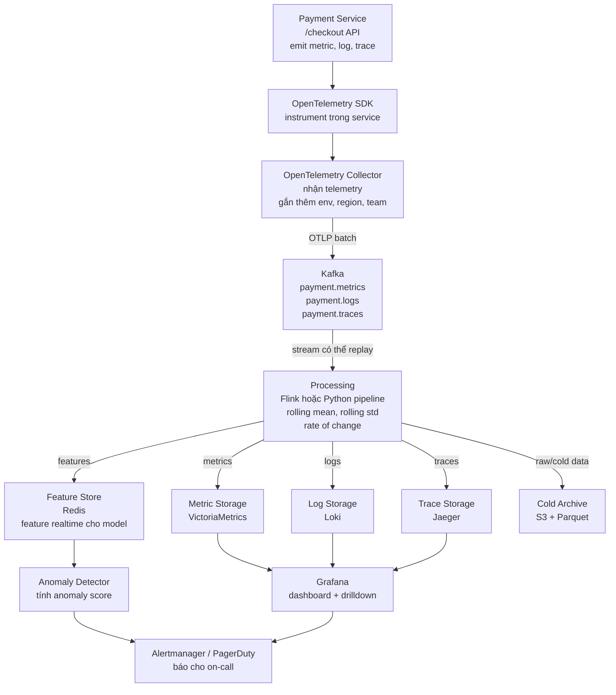

# Diagram - Anomaly Detection cho Payment Service

Use case em chọn là **anomaly detection cho payment service**.

## Diagram Mermaid

## Giải thích để vẽ lại bằng draw.io nếu cần

Em sẽ vẽ theo thứ tự từ trái sang phải:

1. `Payment Service` là service chính, ví dụ endpoint `/checkout`.
2. Service dùng `OpenTelemetry SDK` để gửi metric, log, trace ra ngoài.
3. `OpenTelemetry Collector` đứng giữa để nhận telemetry và gắn thêm metadata như `env`, `region`, `team`.
4. `Kafka` làm lớp transport. Em dùng Kafka vì nó giống buffer ở giữa, nếu processing hoặc storage bị chậm thì data chưa mất ngay.
5. `Processing` là nơi tính feature như rolling mean, rolling std, rate of change. Trong bài code nhỏ thì em dùng Python pipeline, còn hệ thống lớn có thể dùng Flink.
6. Feature realtime được ghi vào `Redis` để anomaly detector đọc nhanh.
7. Data gốc được lưu vào các storage riêng:
   - Metric vào `VictoriaMetrics`
   - Log vào `Loki`
   - Trace vào `Jaeger`
   - Dữ liệu lâu dài vào `S3 + Parquet`
8. `Grafana` dùng để xem dashboard và drilldown.
9. Nếu detector thấy anomaly thì gửi alert qua `Alertmanager/PagerDuty`.

## Luồng debug em hiểu

Khi payment latency tăng, metric sẽ báo trước. Sau đó người vận hành mở Grafana để xem thời điểm nào tăng, xem trace để biết request chậm ở service nào, rồi đọc log của service đó để tìm lỗi cụ thể như DB timeout hoặc external API chậm.
